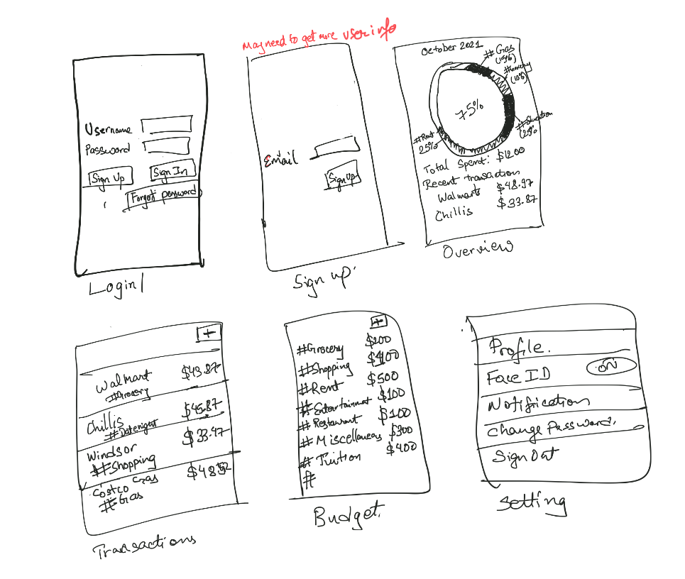
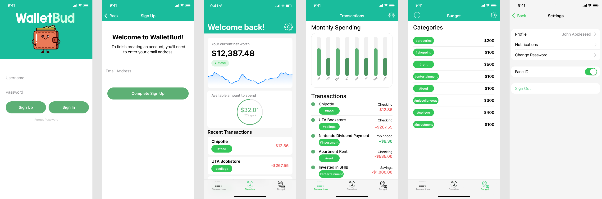
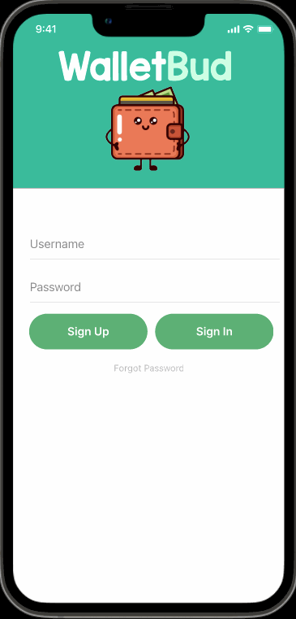
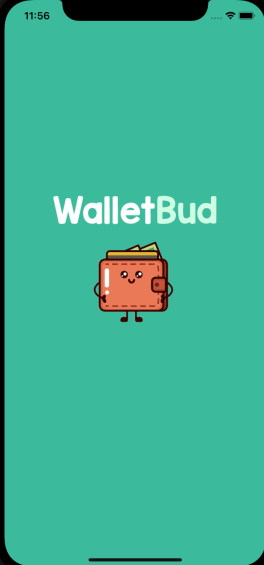
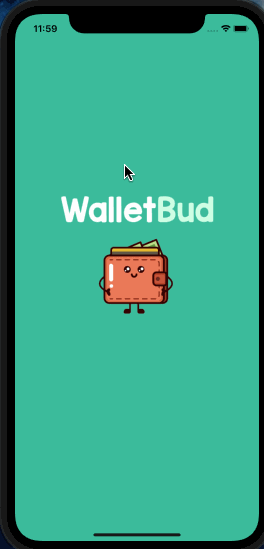
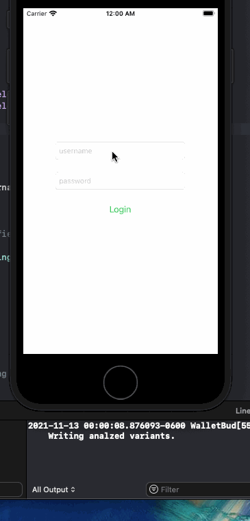

# WalletBud

## Table of Contents
1. [Overview](#Overview)
1. [Product Spec](#Product-Spec)
1. [Wireframes](#Wireframes)
2. [Schema](#Schema)

## Overview
### Description
Tracks expenses of an individual to better manage their cashflow. The app can ideally enable users to meet their financial goals.

### App Evaluation
- **Category:** Finance / Expense Tracker
- **Mobile:** Being a native iOS app, this app would allow users to take advantage of push notifications and the camera.
- **Story:** This app would encourage and empower users to understand and take control of their spending habits. As such, this app would assist users in creating and following smarter financial planning.
- **Market:** Anyone seeking to view and manage how they are spending money of their finances can use this app. Everyone has finances to take care of so this app can tap into a large potential user base.
- **Habit:** The app could be used everytime a user makes a transaction. 
- **Scope:** At the initial stage, we would start with keeping track of the expenses that user enters and visualize the results based on preset budget allowing users to self analyze where the user should control their expenditure. 

## Product Spec

### 1. User Stories (Required and Optional)

**Required Must-have Stories**

- [x] User can create a new account
- [x] User can login to their account and stay signed in
- [ ] User can add a transaction with a pre-defined hash tag
- [ ] User can set up a monthly budget
- [ ] User can edit their monthly budget to be applied to the current month or following months.
- [ ] User can sign out

**Optional Nice-to-have Stories**

- [ ] User can search transactions based on hashtags or text
- [ ] User can add new hashtags for their budget
- [ ] User can linked their bank account/credit cards that automatically pulls all the transactions to the app.
- [ ] User can enter recurring transactions automatically that applies to a user defined frequency (weekly, biweekly or monthly) and also a user defined duration. These transactions could include utilities, tuitions etc. 

### 2. Screen Archetypes

* Login Screen
   * User can login 
* Registration Screen
   * User can create a new account
   * Upon closing the app, the user stays signed in 
* Overview Screen
    * For the first instance, user is asked to set up their budget and/or add transactions.
    * User can view remaining expenses budget and recent transactions
* Transactions Screen
    * User can add transaction and assign a hashtag with it.
    * User can see details about the transaction
    * User can delete a transaction
* Budget Screen
    * User sets up their budget based on the predefined hashtag and assign a maximum limit to each category (aka hashtag)
* Settings Screen
  * User can change their password
  * User can adjust other user details such as their name
  * User can set up their notification preferences
  * User can allow iPhone authentication method (such as FaceID or TouchID) to sign into the app.
  * User can sign out
 

### 3. Navigation

**Tab Navigation** (Tab to Screen)

* Overview Screen
* Transactions Screen
* Budget Screen

**Flow Navigation** (Screen to Screen)

* Login
   => Overview
* Registration
   => Overview
* Overview
   => Transactions
   => Budget
* Transactions
   => Overview
   => Budget
* Budget
   => Overview
   => Transactions

## Wireframes


### [BONUS] Digital Wireframes & Mockups


### [BONUS] Interactive Prototype


## Schema 
### Models
#### Users

   | Property      | Type     | Description |
   | ------------- | -------- | ------------|
   | UserId      | String   | unique user id (default field) |
   | UserName        | String | User name for login |
   | Email         | String     | user's email |
   | Password       | String   | user's password |
   | Date of Birth | DateTime   | user's date of birth |
   | First Name    | String   | user's first name |
   | Last Name     | String | user's last name |
  
   
#### User_Setting

   | Property      | Type     | Description |
   | ------------- | -------- | ------------|
   | ObjectId      | String   | unique  id  for the setting(default field) |
   | User        |Pointer to User | user's settings |
   | Notification | Boolean | user's preference on notification |
   | FaceID    | Boolean | user's preference on using faceId for signin |
   | CurrentNetWorth    | Number | user's current net worth |
   
#### HashTags

   | Property      | Type     | Description |
   | ------------- | -------- | ------------|
   | objectId      | String   | unique id for the user defined hashtag per user (default field) |
   | User        | Pointer to User | user who created the hashtag  |
   | Hashtag         |    String  | Title of the hashtag |
   
   
#### Transactions

   | Property      | Type     | Description |
   | ------------- | -------- | ------------|
   | objectId      | String   | unique id for the user transaction (default field) |
   | User        | Pointer to User | user who created the transaction |
   | Hashtag         | Pointer to HashTag     | hashtag defining user's transaction |
   | Amount       | Number   | transaction amount |
   | Transaction Vendor | String   | Vendor where the transaction occured |
   | Transaction date    | DateTime   | Date when transaction occured |

#### Budget

   | Property      | Type     | Description |
   | ------------- | -------- | ------------|
   | objectId      | String   | unique id for the budget (default field) |
   | User        | Pointer to User | user who created the budget |
   | Hashtag         | Pointer to HashTag     | hashtag that define the type of budget |
   | Budget Amount       | Number   | budget amount for the hashtag |
   | Month Year | DateTime   | Month and year for which the budget is for |


### Networking
- Login Screen
  - (Read/GET) Check if username and password is valid
       ``` swift
        PFUser.logInWithUsername(inBackground: username, password: password){
            (user,error) in
            if user != nil {
              // let the user try again and show error.
            } else {
              // Hooray! Let them use the app now.
            }
        }
       ```
- SignUp Screen
  - (Create/POST) SignUp a new user
    ``` swift
       PFUser.signUpInBackground {(success: Bool, error: Error?) in
          if  success  {
            // Show the errorString somewhere and let the user try again.
          } else {
            // Hooray! Let them use the app now.
          }
        }
    ```
- Transaction Screen
   - (Read/GET) Query transactions of the user  
     ``` swift
            let query = PFQuery(className:"Transactions")
             query.whereKey("User", equalTo: currentUser)
             query.order(byDescending: " Transaction_date ")
             query.findObjectsInBackground { (transactions: [PFObject]?, error: Error?) in
                if let error = error { 
                   print(error.localizedDescription)
                } else if let transactions = transactions {    
               // TODO: Do something with transactions...
                }
             }
        ```
         
    - (Update/PUT) Update transactions
        ``` swift
            let query = PFQuery(className:"Transactions")
            query.getObjectInBackground(withId: "xWMyZEGZ") { (transactions: PFObject?, error: Error?) in
            if let error = error {
                print(error.localizedDescription)
            } else if let transactions = transactions {
               // Update transactions info
                transactions.saveInBackground()
            }
        ```
    - (Delete) Delete existing transaction
       ```swift
          PFObject.deleteAll(inBackground: objectArray) { (succeeded, error) in
          if (succeeded) {
              // The array of objects was successfully deleted.
          } else {
              // There was an error. Check the errors localizedDescription.
          }
          }
       ```
 - Budget Screen
    - (Create/POST) Create a budget object for the month 
    ``` swift
      let budget = PFObject(className:"Budget")
     // populate budget object
      budget.saveInBackground { (succeeded, error)  in
          if (succeeded) {
              // The object has been saved.
          } else {
              // There was a problem, check error.description
          }
      }
    ```
    - (Update/PUT) Update Budget
        ``` swift
            let query = PFQuery(className:"Budget")
            query.getObjectInBackground(withId: "xWMyZEGZ") { (budget: PFObject?, error: Error?) in
            if let error = error {
                print(error.localizedDescription)
            } else if let budget = budget {
               // Update budget info
                budget.saveInBackground()
            }
        ```
    - (Read/GET) Get my Budget
      ```swift
         let query = PFQuery(className:"Budget")
         query.whereKey("User", equalTo: currentUser)
         query.whereKey("Month Year", equalTo: currentMonth)
         query.findObjectsInBackground { (budget: [PFObject]?, error: Error?) in
            if let error = error { 
               print(error.localizedDescription)
            } else if let budget = budget {
  
           // TODO: View budget...
            }
         }
       ```
- Overview Screen
    - (Read/GET) Read transactions   
        ```swift
             let query = PFQuery(className:"Transactions")
             query.whereKey("User", equalTo: currentUser)
             query.order(byDescending: " Transaction_date ")
             query.findObjectsInBackground { (transactions: [PFObject]?, error: Error?) in
                if let error = error { 
                   print(error.localizedDescription)
                } else if let transactions = transactions {
               // TODO: Do something with transactions.
                }
             }
        ```
    - (Read/GET) Read Budget
       ```swift
         let query = PFQuery(className:"Budget")
         query.whereKey("User", equalTo: currentUser)
         query.whereKey("Month Year", equalTo: currentMonth)
         query.findObjectsInBackground { (budget: [PFObject]?, error: Error?) in
            if let error = error { 
               print(error.localizedDescription)
            } else if let budget = budget {
  
           // TODO: Do something with budget...
            }
         }
       ```
- Setting Screen
     - (Update/Put) Update settings based on user selection
       ``` swift
            let query = PFQuery(className:"User_Setting")
            query.getObjectInBackground(withId: "xWMyZEGZ") { (setting: PFObject?, error: Error?) in
            if let error = error {
                print(error.localizedDescription)
            } else if let setting = setting {
               // Update setting info
                setting.saveInBackground()
            }
        ```
     - (Read/Get) Get Current selection
        ```swift
         let query = PFQuery(className:"User_Setting")
         query.whereKey("User", equalTo: currentUser)

         query.findObjectsInBackground { (setting: [PFObject]?, error: Error?) in
            if let error = error { 
               print(error.localizedDescription)
            } else if let setting = setting {
  
           // TODO: Update UI based on retrived object
            }
         }
       ```
         


- [OPTIONAL: List endpoints if using existing API such as Yelp]

### Current Progress - Unit 12 Milestone


### Unit 11 Milestone


### Unit 10 Milestone


